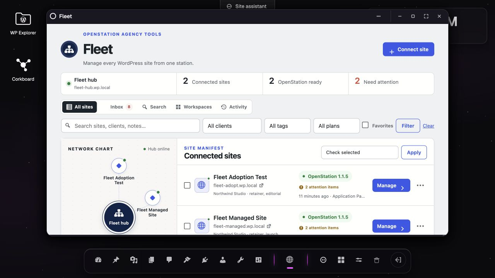
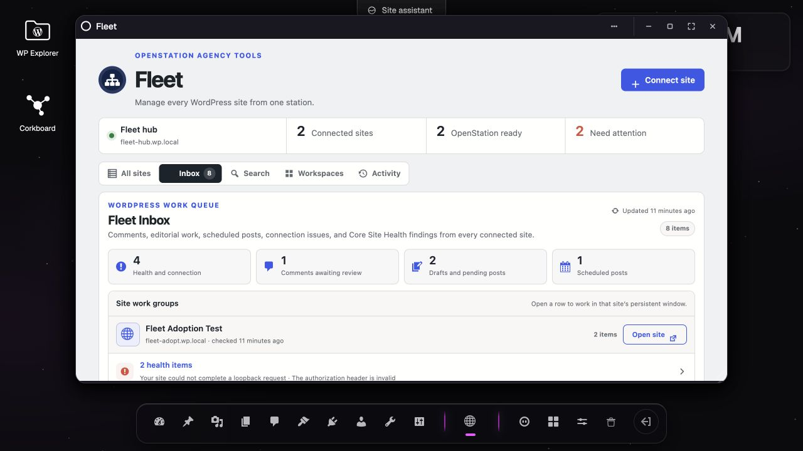
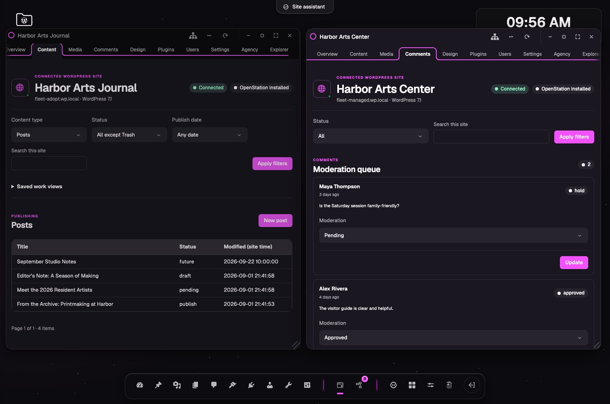
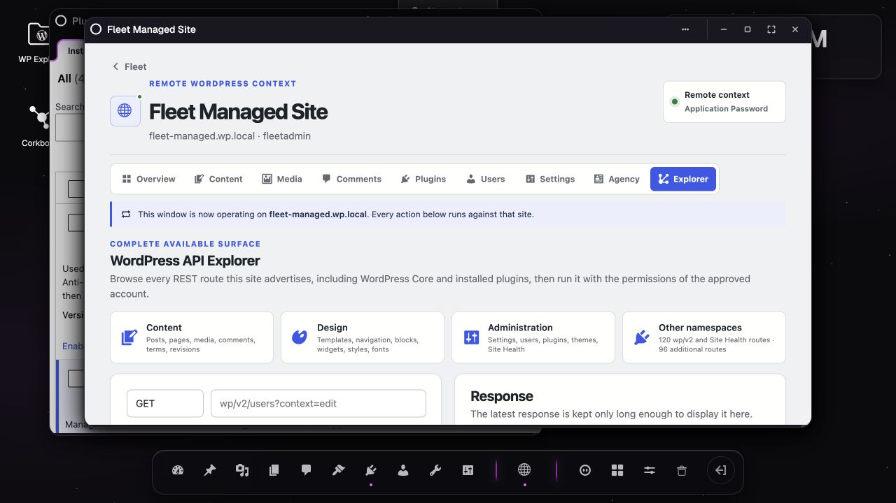

# Fleet for OpenStation

**Your WordPress sites, all in one place.**

Fleet turns one OpenStation install into a desktop for every WordPress site you manage. See what needs attention, open the right site in its own window, and get the work done without bouncing through bookmarks, login screens, and wp-admin tabs.

Each site stays independent. Fleet is installed once on your hub—not on every client site.

## One place to start the day

Managing one WordPress site is simple. Managing ten unrelated sites means ten dashboards, ten places to check, and ten chances to make the right change on the wrong site.

Fleet gives that work one home without turning your sites into a Multisite network or handing them to a hosted management service. The hub shows every connected site, who it belongs to, whether it is healthy, and what is waiting for you. Client sites keep their own hosting, users, content, and permissions.

## The work comes to you

Fleet Inbox brings pending comments, drafts, posts awaiting review, scheduled work, connection problems, and useful Site Health findings into one queue. Search helps you find content, media, comments, and people across a secure index Fleet updates incrementally in the background.

Instead of visiting every dashboard to look for work, open Fleet and start with the work that already found you.

Large fleets stay responsive because Fleet checks sites in short, resumable passes. Fast status checks stay frequent, heavier metadata and search work runs less often, and unavailable sites automatically back off until they recover.

## Every site gets its own window

Open two client sites side by side and each keeps its own name, navigation, and state. You can work on one site while another stays open for reference, without losing track of which WordPress install you are changing.

Group related sites under a client name and Fleet builds a reusable workspace for them. One click opens up to eight clearly named site windows; larger workspaces stay easy to reach from Fleet.

## Manage the site in front of you

Fleet has focused views for posts, pages, media details, comments, block-theme design, plugins, users, settings, and private agency notes. Common work stays clear and approachable. When you need something more advanced, Explorer can use any REST route that the connected WordPress site advertises, subject to that WordPress account’s normal capability checks.

That means WordPress remains the source of truth. Fleet does not invent a second permissions system or require custom endpoints on client sites.

## One Fleet installation

Fleet belongs only on the hub. A managed site needs WordPress Core, HTTPS, and an administrator who can approve the connection. During setup, Fleet can install or activate OpenStation on that site so it can open as a native desktop window; the Fleet plugin itself is never copied there.

The approval happens on WordPress’s own Application Password screen. Fleet never receives the administrator’s normal password. WordPress creates a separate credential that can be revoked at any time, and Fleet encrypts its copy on the hub.

## Try Fleet

Fleet currently requires WordPress 6.5 or newer, PHP 7.4 or newer, HTTPS, and an OpenStation build with the experimental App Framework.

1. Download `fleet-for-openstation.zip` from the [latest release](https://github.com/RegionallyFamous/fleet-for-openstation/releases).
2. Install OpenStation and Fleet on the WordPress site you want to use as the hub.
3. Open **Fleet**, enter a client site’s HTTPS address, and approve the connection on that site.
4. Return to Fleet and choose **Manage**.

Fleet is an early preview for hands-on testing. It does not replace backups, uptime monitoring, malware scanning, or a credential vault.

Detailed setup, security, architecture, API coverage, development, and troubleshooting notes live in the [Fleet wiki](https://github.com/RegionallyFamous/fleet-for-openstation/wiki). Found a rough edge? [Open an issue](https://github.com/RegionallyFamous/fleet-for-openstation/issues).

Fleet for OpenStation is licensed under GPL-2.0-or-later.
