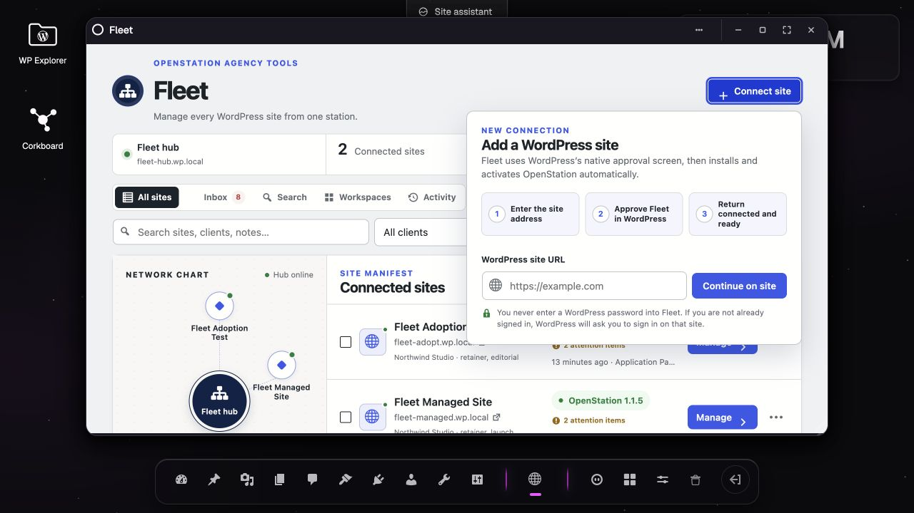
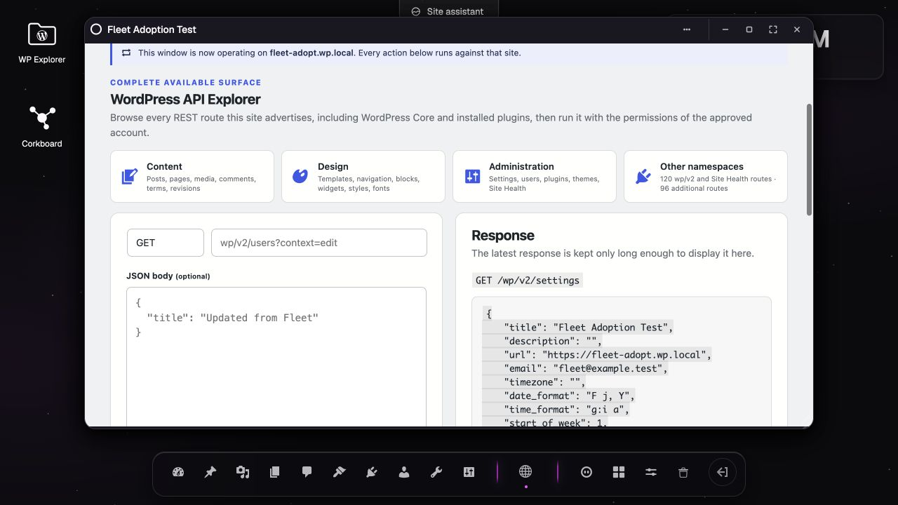
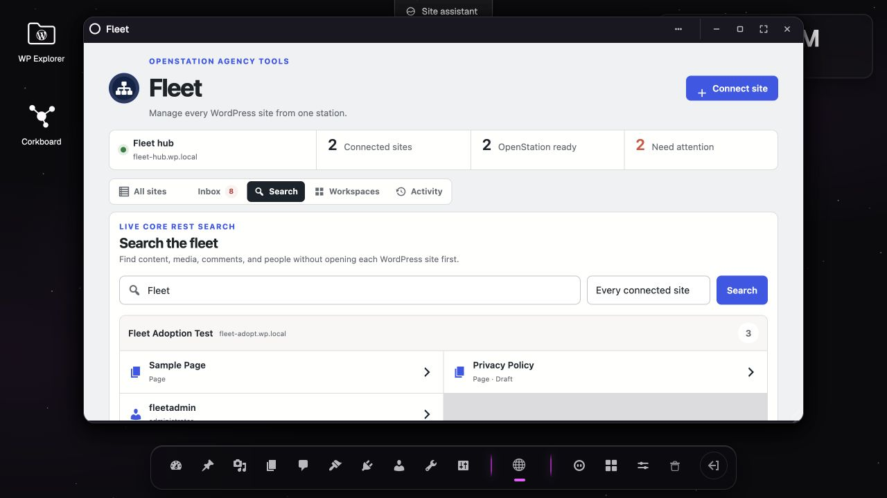
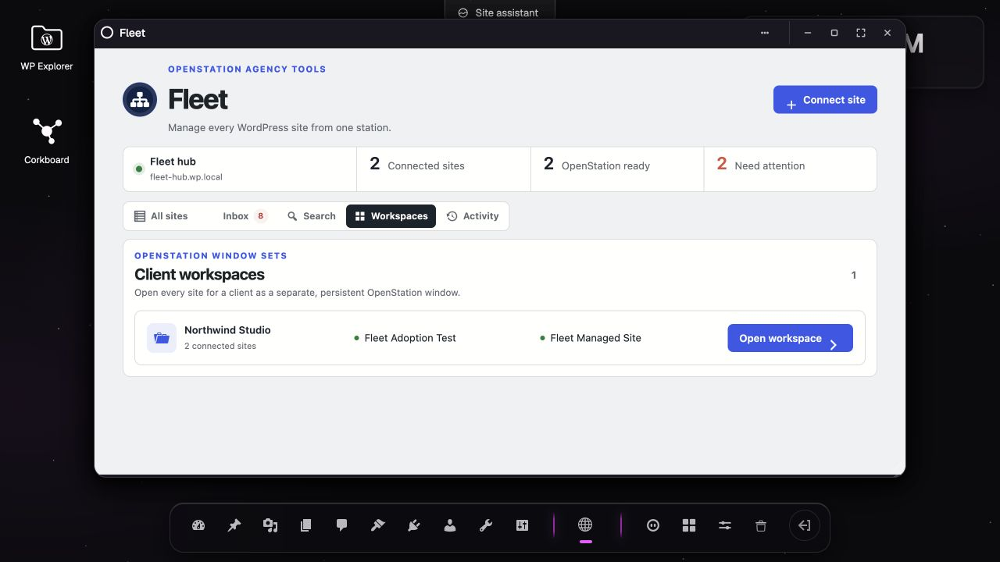

# Fleet for OpenStation

Manage all of your WordPress sites from one OpenStation desktop.

Fleet turns one OpenStation install into an agency hub. Connect a client site, select **Manage site**, and work on that site's content, comments, media, plugins, users, settings, and REST APIs without opening its wp-admin.

> [!IMPORTANT]
> Fleet is an early preview built for hands-on testing. It is not yet a replacement for a backup, monitoring, or security service.

## See Fleet in action

*One OpenStation install becomes the control center for every connected site.*

*Each site keeps its own window and workspace, so the hub and multiple client sites can stay open together.*

## Who Fleet is for

Fleet is for agencies, freelancers, and teams that look after more than one WordPress site. The WordPress install where Fleet is activated becomes the **hub**. Every other connected WordPress install is a **managed site**.

The distinction is simple:

- **Hub:** OpenStation and Fleet for OpenStation are active.
- **Managed site:** A WordPress site that approved the hub's connection. Fleet installs or activates OpenStation there automatically.

## What you can do

- Connect a WordPress site with its native, revocable Application Password approval—no normal WordPress password is shared.
- See whether OpenStation is missing, inactive, or active.
- Adopt a regular WordPress site: after one approval, Fleet installs and activates OpenStation automatically.
- Check or install OpenStation across a selection of sites with safe bulk actions.
- See an attention queue built from connection failures, OpenStation status, Core Site Health checks, and WordPress versions.
- Use **Fleet Inbox** to collect pending comments, drafts, posts awaiting review, scheduled posts, and existing health findings across every site.
- Search content, media, comments, and users across the fleet without opening each site first.
- Open a persistent client workspace that raises every site assigned to that client in its own OpenStation window.
- Open each managed site in its own named OpenStation window, so two or more sites can stay open side by side without opening another wp-admin.
- Change core site identity, timezone, and date settings.
- Update post and page titles or publishing status.
- Moderate comments and update or upload Media Library items.
- Install WordPress.org plugins and activate or deactivate installed plugins.
- Create users and update their display name, email, and role.
- Organize sites by client, tag, plan status, notes, and favorites; then search or filter the fleet.
- Review a private history of Fleet actions.
- Browse a live, searchable **Explorer** of every REST route the site advertises, then run allowed GET, POST, PUT, PATCH, or DELETE requests without knowing the route in advance.
- Disconnect from either side and revoke the connection.

The focused tabs are the friendlier path for common jobs. The Explorer provides the complete API surface while dedicated Fleet interfaces grow. That includes Core routes for content types, taxonomies, revisions, navigation, templates, template parts, blocks, widgets, global styles, fonts, users, plugins, themes, settings, and Site Health when the selected site exposes them. Fleet cannot manage a feature that the managed site does not expose through the WordPress REST API.

Fleet does not install a companion agent or register custom endpoints on managed sites. The Inbox, Search, and focused management screens use the Core REST routes each WordPress installation already advertises. Fleet uses Core's batch controller when available to keep multi-collection reads efficient.

## Before you start

| | Fleet hub | Managed site |
|---|---|---|
| WordPress | 6.5 or newer | 6.0 or newer |
| PHP | 7.4 or newer | Whatever the installed OpenStation release requires |
| HTTPS | Required | Required |
| Plugins | OpenStation and Fleet for OpenStation | None required before connecting |
| Access | Administrator | An administrator allowed to perform the work Fleet will do |

Both sites must be publicly reachable over HTTPS. WordPress permissions still apply to every remote request: Fleet can do only what the account that approved the connection can do.

## Install Fleet

1. Download `fleet-for-openstation.zip` from the [newest available release](https://github.com/RegionallyFamous/fleet-for-openstation/releases).
2. On the WordPress site you want to use as the hub, install and activate [OpenStation](https://github.com/WordPress/openstation).
3. Go to **Plugins → Add New Plugin → Upload Plugin**.
4. Upload the ZIP and activate Fleet for OpenStation.
5. Open **Fleet** from wp-admin or the OpenStation desktop.

## Connect your first site

1. Enter the managed site's full HTTPS address, such as `https://client.example`.
2. Select **Continue on site**.
3. Sign in to that site if WordPress asks.
4. Review the native WordPress connection request and approve it.
5. Fleet returns immediately to a visible setup screen while WordPress installs or activates OpenStation.
6. Select **Manage**.

Fleet never asks you to type a WordPress password into Fleet. If the managed site asks for one, you are signing in directly to that WordPress installation before its native approval screen appears.

### Why WordPress calls it an Application Password

An Application Password is a separate credential generated by WordPress for one integration. It is not the administrator's normal password. Fleet stores it encrypted on the hub and sends it only to that site's HTTPS REST API. The connection can be revoked without changing the administrator's sign-in password.

If automatic OpenStation installation is unavailable on the host, Fleet keeps the working WordPress connection and shows **Finish OpenStation setup** on the site card. You can retry without reconnecting.

## Manage a connected site

Select **Manage** on a connected-site card. Fleet opens a stable OpenStation window named for that site. Opening the same site again focuses its existing window and preserves where you were; opening another site creates another window, so both remote contexts can remain on the desktop at once. The window header and context strip always name the site being controlled.

The workspace shows only the tabs that the managed site advertises through its REST API:

- **Overview** shows live site details, attention items, Core Site Health, and recent content.
- **Content** edits recent posts and pages.
- **Media** uploads files and edits Media Library details.
- **Comments** moderates recent comments.
- **Plugins** installs WordPress.org plugins and manages installed plugin status.
- **Users** creates users and edits names, email addresses, and roles.
- **Settings** changes common Core settings.
- **Agency** stores client details, tags, plan status, private notes, and favorite status on the hub.
- **Explorer** lists every route currently advertised by WordPress Core and plugins, shows supported methods, filters the inventory, and sends GET, POST, PUT, PATCH, or DELETE requests.

Use **Fleet** in a managed-site window to focus the hub without closing your remote workspace. Fleet windows are deliberately capped and centered in OpenStation instead of filling the desktop.

The Explorer is the escape hatch for anything a site exposes through REST but Fleet does not yet have a dedicated screen for. It uses the approved WordPress account's permissions and shows the real response before you continue.

## Run the whole fleet

**Inbox** is the agency work queue. It combines the latest cached Core collection counts with connection and Site Health findings. Fleet refreshes it during normal site checks and its existing 15-minute scheduled checks; select **Check now** whenever you need an immediate reading.

**Search** runs authenticated, read-only searches against existing Core content, page, media, comment, and user collections. Search all connected sites or narrow the request to one client. On fleets larger than 25 sites, choose a client to keep a live search focused and responsive.

**Workspaces** groups sites by the client name stored in their Agency profile. Select **Open workspace** to open or focus every site in that group as a separate OpenStation window. Existing windows retain their current section instead of being duplicated.

## Disconnect a site

Select **Disconnect** next to the site. Fleet revokes that exact Application Password before removing the local record. A managed-site administrator can also revoke it under **Users → Profile → Application Passwords**. Disconnect every site before uninstalling Fleet; uninstalling a hub plugin cannot reliably contact every managed site.

## What Fleet deliberately leaves to other tools

Fleet does not replace backups, restores, uptime monitoring, malware scanning, or a shared secrets vault. Its job is WordPress management through WordPress APIs, inside OpenStation.

## Need help?

- [Troubleshooting](https://github.com/RegionallyFamous/fleet-for-openstation/wiki/Troubleshooting)
- [How Fleet works](https://github.com/RegionallyFamous/fleet-for-openstation/wiki/Architecture)
- [Security model](https://github.com/RegionallyFamous/fleet-for-openstation/wiki/Security)
- [Current scope and next steps](https://github.com/RegionallyFamous/fleet-for-openstation/wiki/Current-Scope)
- [Development and packaging](https://github.com/RegionallyFamous/fleet-for-openstation/wiki/Development)

Found a bug or a rough edge? [Open an issue](https://github.com/RegionallyFamous/fleet-for-openstation/issues).

## License

Fleet for OpenStation is licensed under GPL-2.0-or-later.
