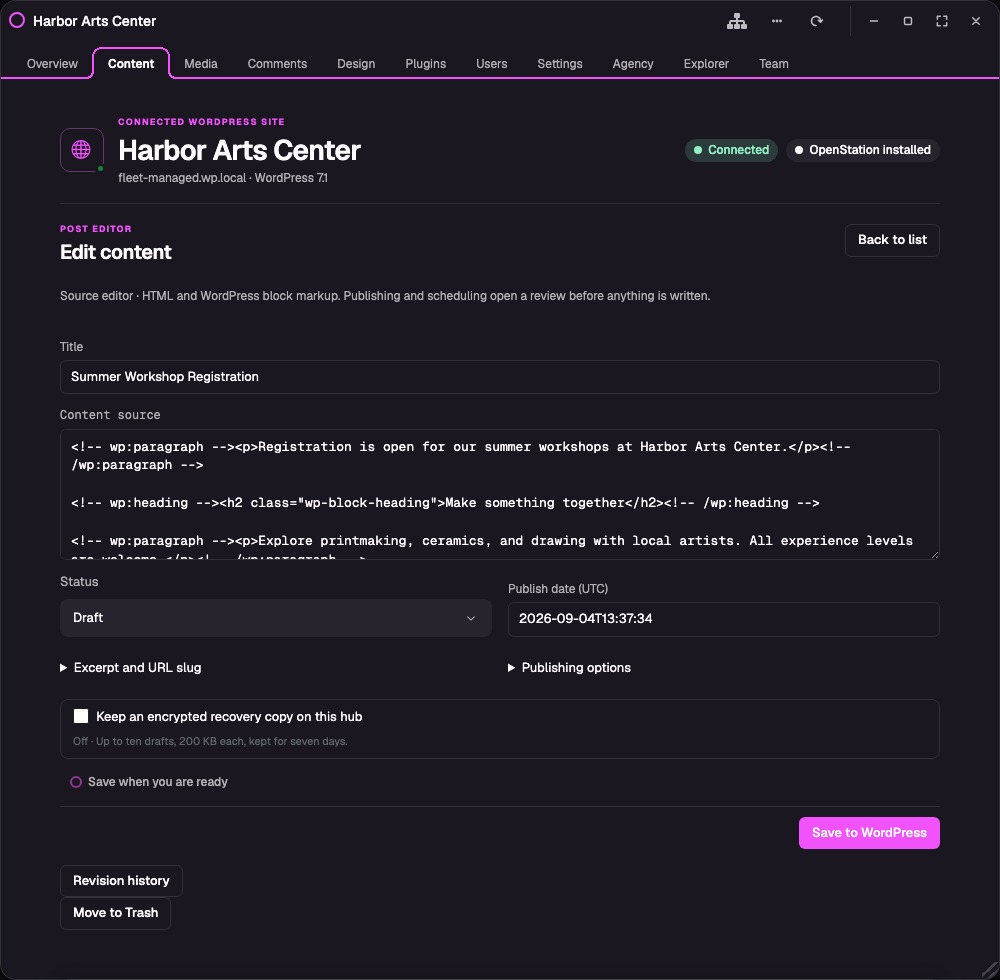
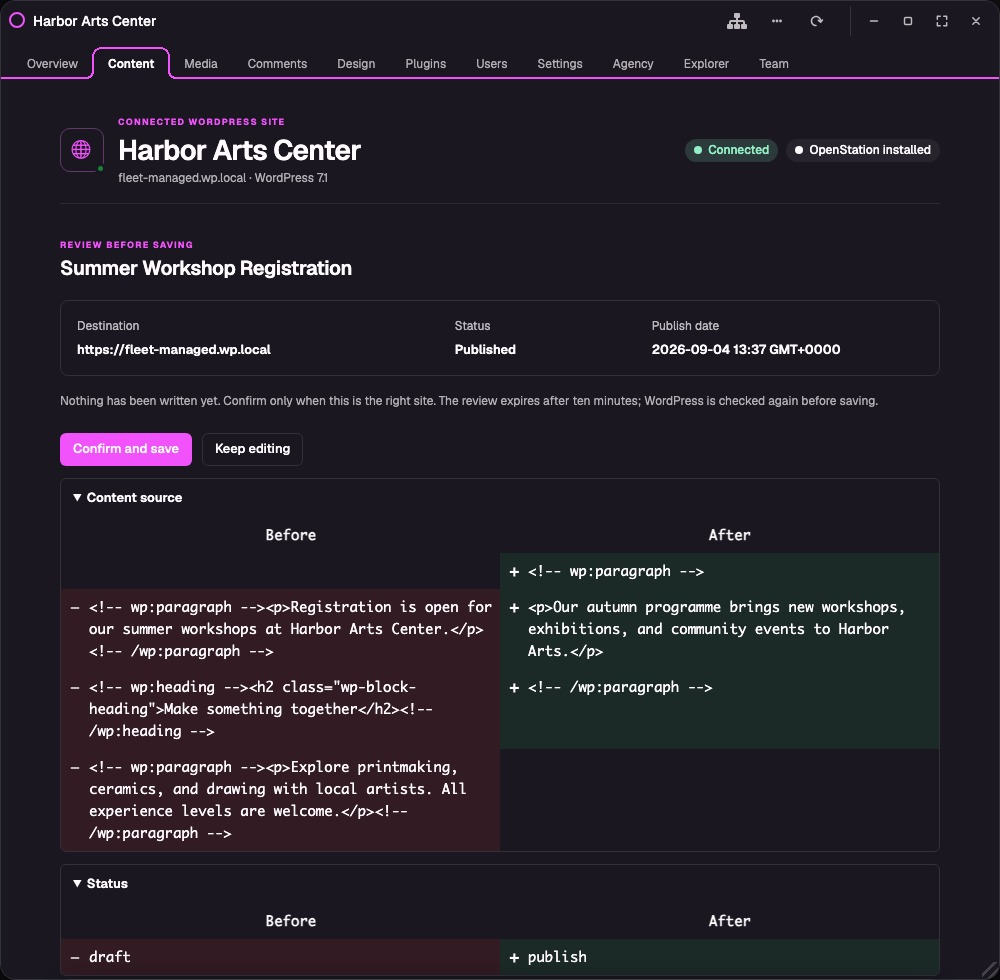

# Fleet for OpenStation

**Stop managing client sites one browser tab at a time.**

Fleet turns one OpenStation installation into a calm desktop for every WordPress site you look after. See what needs attention, open the right site in its own window, and finish the work without bouncing through bookmarks, login screens, and wp-admin tabs.

Each site keeps its own hosting, content, users, and permissions. Fleet is installed once on your hub—not on every client site.

## One place to start the day

One WordPress site is easy. Ten unrelated client sites mean ten dashboards, ten places to check, and ten chances to make the right change on the wrong site.

Fleet gives that work one home. The hub shows every connected site, who it belongs to, whether its information is fresh, and what is waiting for you. Fleet Inbox brings pending comments, drafts, scheduled work, connection problems, and useful Site Health findings into one queue. Fleet Search finds content, media, comments, and people across a secure index that refreshes in the background.

## The right site stays in front of you

Every connected site opens in a clearly named OpenStation window with its own navigation and state. Keep two client sites open side by side, or group related sites into a reusable client workspace. You can work in one while another stays open for reference without losing track of which WordPress install you are changing.

## Finish everyday WordPress work without another wp-admin

Create and edit posts, pages, and compatible custom content. Choose authors, featured images, categories, and tags. Upload media, moderate and reply to comments, manage users and plugins, change common settings, inspect block-theme resources, and keep private agency notes beside the site.

The editor works with HTML and WordPress block source; it is not the visual block editor. Before publishing or scheduling, Fleet shows the destination, timing, and changes for review. Conflict checks, revision comparison, unsaved-change warnings, and optional encrypted draft recovery help protect work without replacing WordPress or your backups.

## WordPress stays in control

Fleet uses the REST routes and capability checks the connected site already exposes. It does not iframe remote wp-admin, turn the sites into Multisite, install a Fleet agent on them, or add custom Fleet endpoints.

Connection approval happens on WordPress's own Application Password screen. Fleet never receives the administrator's normal password. WordPress creates a separate credential that can be revoked at any time, and Fleet encrypts its copy on the hub. Connections are private until their owner explicitly shares read-only, editorial, or operator access with another hub user.

## Try Fleet

Fleet targets WordPress 7.1 or newer, PHP 8.3 or newer, HTTPS, sodium, and an OpenStation build with the experimental App Framework. Older WordPress versions and a classic wp-admin fallback are intentionally unsupported.

1. Download `fleet-for-openstation.zip` from the [0.10.0-alpha.1 reliability preview](https://github.com/RegionallyFamous/fleet-for-openstation/releases/tag/v0.10.0-alpha.1).
2. Install OpenStation and Fleet on the WordPress site you want to use as the hub.
3. Open **Fleet**, enter a client site's HTTPS address, and choose **Check connection**.
4. Approve the connection on that site, return to Fleet, and choose **Finish setup**.

**0.10.0-alpha.1 is a public GitHub pre-release for development, staging, and agency pilots—not a general-availability release.** Its saved multi-window behavior is verified with the exact OpenStation build in [PR #763](https://github.com/WordPress/openstation/pull/763), but that fix is not yet part of a released OpenStation build. Long-duration and independent-hosting launch gates also remain open.

For the details, use the [getting-started guide](https://github.com/RegionallyFamous/fleet-for-openstation/wiki/Getting-Started), [management guide](https://github.com/RegionallyFamous/fleet-for-openstation/wiki/Managing-Sites), [current capability map](https://github.com/RegionallyFamous/fleet-for-openstation/wiki/Current-Scope), [security model](https://github.com/RegionallyFamous/fleet-for-openstation/wiki/Security), [screenshot gallery](https://github.com/RegionallyFamous/fleet-for-openstation/wiki/Screenshots), and [launch status](https://github.com/RegionallyFamous/fleet-for-openstation/wiki/Reliability-Milestone).

Fleet does not replace backups, uptime monitoring, malware scanning, or a credential vault. Found a rough edge? [Open an issue](https://github.com/RegionallyFamous/fleet-for-openstation/issues).

Fleet for OpenStation is licensed under GPL-2.0-or-later.
